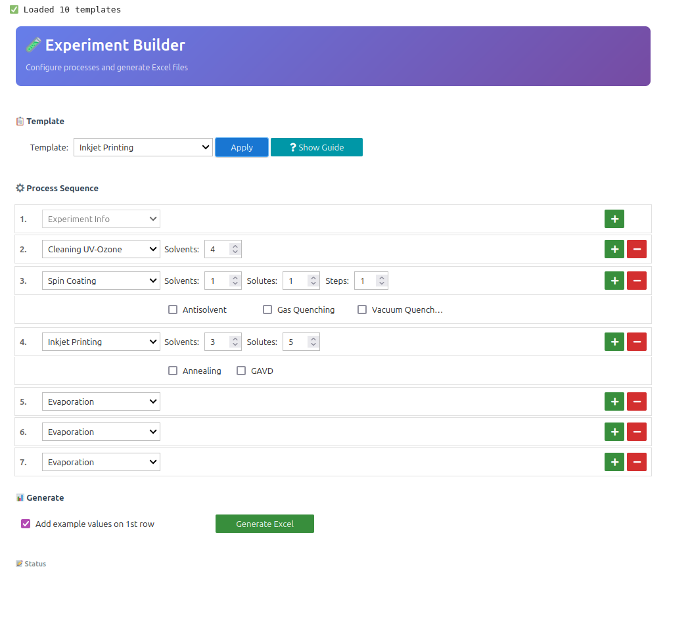

# Spreadsheet Workflow – Documenting Solar Cell Synthesis and Measurements

This guide explains how to document your solar cell synthesis using the corresponding workflow of your facilities. This process involves using a spreadsheet to record synthesis details and then uploading the sheet along with your measurement files to the NOMAD data management platform.

---

## Why do we need this workflow?

Documenting experiments in a structured way is crucial for several reasons:

- **Reproducibility:** Allows you and others to understand and reproduce your experiments in the future.
- **Data Quality:** Ensures your data is well-organized and properly described, making it more valuable.
- **Data Sharing:** Enables you to easily share your data with colleagues and the wider scientific community.
- **NOMAD Integration:** Ensures your data can be seamlessly integrated into the NOMAD database, making it accessible and searchable for future research.

---

## The Spreadsheet Workflow

The workflow consists of the following steps:

- **Planning the Experiment**
- **Getting the experimental tracking spreadsheet**
   
      - **Contact the data stewards**
      
      The data stewards will provide you with the appropriate spreadsheet template for your specific experiment.
      
      Specify your needs: When requesting the sheet, provide details about your experiment (synthesis steps, spinsteps, number of solutes and solvents, etc.) so they can provide the correct template.

      - **Or Create your own Spreadsheet**

      TODO: Create the equivalent voila and make a visual guide 

      Alternatively, you can create your own spreadsheet by using the [excel_creator Voila tool](https://nomad-hzb-se.de/nomad-oasis/gui/user/uploads/upload/id/mr60amaQRZ-Ta21fXdf64Q/files/Excel_creator/excel_creator.ipynb). 
      > Rule: Always start with the Experiment Info as the first category.
      
      
- **Filling in the Spreadsheet**
   The file comes with a pre-filled line to guide you for how the entries should be formatted, e.g. dates, numerical or text. 

   
   The following table explains the concept and format for the experimental info columns:

| Column      | Description                          |
|------------|--------------------------------------|
| Date         | DD.MM.YYYY or DD/MM/YYYY or DD-MM-YYYY|
| Project_Name | Scientist initials/project name      |
| Batch        | General experiment batch number      |
| Subbatch     | Subset for variations               |
| Sample       | Sample serial number                |
| Nomad ID     | Auto-generated sample ID            |

---
  > **Tips:** For completion purposes, please try to fill in as much information as possible. But you can also leave some columns empty if neccesary. 
   
   > The most frequent errors during file uploads are due to wrong data format used. When you get an error, double check for wrong inputs in the spreadsheet.
   
   > For each process there is a Note column. There you can track your various process notes, values for properties that are not supported by the platform yet, temperature ranges etc.

 There is an [alternative method for creating entries in the NOMAD database](https://nomad-hzb.github.io/nomad-baseclasses/how_to/create_experimental_plan.html), but it is more complex and recommended only for workflows not supported by the current spreadsheet.